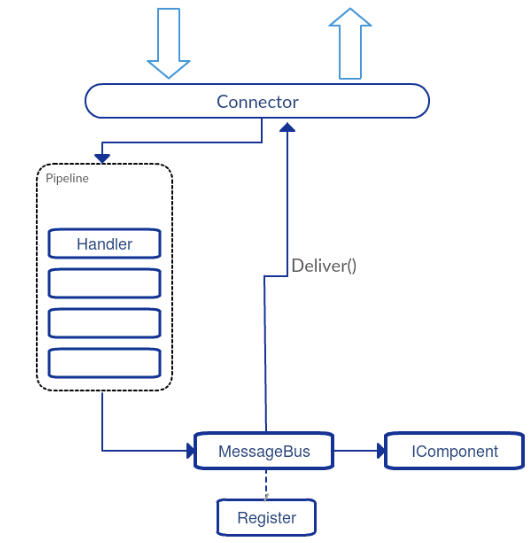

vertx.io based Message Node (VertxMN)
-------------------------------------

### Overview

#### Functional location in the reTHINK Architecture

The vertx.io based Message Node is one of the reference implementations of the Message Node component in the reTHINK Architecture. The overall role of Message Nodes in the reTHINK Architecture is described in detail in [Hyperty Messaging Framework](https://github.com/reTHINK-project/dev-service-framework/blob/master/docs/manuals/hyperty-messaging-framework.md).

A general documentation and guideline for the development of Message nodes is given in [Message Nodes and Protostubs Development](https://github.com/reTHINK-project/dev-service-framework/blob/master/docs/manuals/development-of-protostubs-and-msg-nodes.md).

#### Dependencies

One of the responsibilities of Message Nodes in the reTHINK architecture is to perform the interactions with the Domain registry. Runtimes send special messages to the Message Nodes to register or query hyperties or data objects at the domain registry. The Message Nodes have to perform the interactions with the registry component and return the results back to the Runtime.

There is a need to have the domain registry running and configured. However, there is no specific initiation sequence. The procedures to achieve this are described in the following section.

### User View

This chapter provides instructions for the setup, configuration and operation of the Vertx Message Node as a docker container. The Docker file is already available in the repository.

#### 1. Installation of Git and Docker

You need to set up the following requirements. - [docker](https://docs.docker.com/) - [git client tool](https://git-scm.com/downloads) This is already a Docker dependency. If already installed you may skip it. - Test Docker setup. Fire the Docker shell and run `docker run hello-world`

#### 2. Cloning the repository and running Docker image

```
git clone https://github.com/reTHINK-project/dev-msg-node-vertx.git
cd dev-msg-node-vertx
```

#### 3. Config VertxMN domain

The VertxMN is pointing at default domain `ua.pt`, but if other domain is needed it can be configured in `node.config.json`. Change an already entry, like `dev`, or create a new one. Config entry is selected with an environment variable `MSG_NODE_CONFIG`.

`MSG_NODE_CONFIG = env` is now reserved for configuration through environment variables. The following are used:
* `NODE_DOMAIN`
* `NODE_PORT`
* `NODE_REGISTRY_URL`
* `NODE_GLOBAL_REGISTRY_URL`

#### 4. Build and run Docker

```
docker build -t vertx-msg-node .
docker run -it -e "MSG_NODE_CONFIG=dev" -p 9090:9090 vertx-msg-node
```

**Verify** if the VertxMN is running at docker host port map `https://192.168.99.100:9090/`, should return **Hello**. It's ok at first to have an invalid certificate. The pre-configured self-signed certificate is pointing at host `msg-node.ua.pt` You can config your host OS file and add a new line for `192.168.99.100   msg-node.ua.pt`.

#### 5. Testing

To fire the test suite you need **NPM** and all installed dependencies. - [NodeJS](https://nodejs.org/en/) will install NPM.`
npm install
` - Run 2 instances of the VertxMN to test cluster modes. You can run 2 dockers with diferent port maps `-p 9090:9090` and `-p 9091:9090`. - For unit test it's required to have the correct **host OS file** configured to `msg-node.ua.pt` and domain at **ua.pt** in the selected entry for `node.config.json`. - Run **karma start**

**create user** and **read user** will fail if there is no domain registry running.

#### 6. Certificate installation
Tools needed:
* [Let's Encrypt](https://letsencrypt.org/) for "letsencrypt-auto"
* [Java JDK 8](http://www.oracle.com/technetwork/java/javase/overview/index.html) for "keytool"
* [OpenSSL](https://www.openssl.org/) for "openssl"

"Let's Encrypt" can be used to generate PEM formated certificates if you already have a DNS domain:
* ```letsencrypt-auto certonly --manual -d <domain>```

Convert the generated fullchain and private key files to "pkcs12" with openssl: 
* ```openssl pkcs12 -export -out keystore.pkcs12 -in <path>/fullchain.pem -inkey <path>/privkey.pem```

Import the certificate to java keystore:
* ```keytool -v -importkeystore -srckeystore keystore.pkcs12 -srcstoretype PKCS12 -deststoretype JKS -destkeystore server-keystore.jks```

### Developer view

Once the VertxMN is active, we are able to connect with the ProtoStub. The best example of how this is done is in the test/VertxProtoStub.js in "runtime connectivity" test. It's important to send the "runtimeURL" in the config parameter, because it will be used to link the connection channel to the runtime.

With this it's possible to send messages between runtimes, but Hyperty registration is something that should be done externally.

The connection is auto managed. It means, there is no need to call "connect()" explicitly, and it will always try to be in "connected" until "disconnect()" is called. Status messages are sent to "runtimeProtoStubURL/status".

#### 1. Development dependencies

If the development is made without Docker, aditional dependencies are needed. - [Maven](https://maven.apache.org/install.html). - [Java 8 SDK](http://www.oracle.com/technetwork/java/javase/downloads/jdk8-downloads-2133151.html). - JAVA_HOME environment variable pointing to java path

#### 2. Structure of the project

The "dev-msg-node-vertx" GitHub repository is structured as follows:

-	./Dockerfile ... Docker file to build image.
-	./src/main/java/\** ... The VertxMN source code
-	./src/js/client/\** ... The sources for the Protocol stub
-	./test/\** ... Test cases for the VertxMN
-	./target/ ... Output for distribution files

#### 3. Build and run

Build a VertxMN distribution jar, executing `mvn package`. Build a VertxProtoStub distribution file, executing `gulp build`.

Run VertxMN with `mvn exec:java -Dexec.args="9090"`. This will download all jar dependencies and run.

#### 4. Internal Architecture and components



There are 2 types of components that can integrate in the VertxMN implementation.* Addressable, based in one destination address. Messages are deliver based on the "msg.to" field of the message.* Interceptors that can intercept and verify every message that enters the Message Node, whatever the destination address.

##### Addressable Components

These are implementations of the interface `IComponent extends Handler<PipeContext>`, and are added to the MessageNode with the method `PipeRegistry.installComponent(IComponent component)`. The only difference on the interface (between IComponent and Handler\<PipeContext\>) is an additional method to get the component address name, used for EventBus registration.

##### Interceptor Components

These are implementations of `Handler<PipeContext>`, and are added to the pipeline with `Pipeline.addHandler(Handler<PipeContext> handler)`.

#### Use of PipeContext

Both types receive a `PipeContext` in the **handle** method when a message should be processed by the component. PipeContext gives access to the message with the `getMessage()` method, but also provides other useful methods like:* `next()` method used in Interceptors that order the pipeline to execute the next interceptor. If no other interceptor exits, a delivery is proceeded.* `deliver()` used internally by the pipeline, but can be also used to ignore all other pipeline handlers and deliver the message directly to the component that has the address of "msg.to".* `fail(String from, String error)` interrupts the pipeline flow and sends an error message back to the original "msg.from". The "msg.from" of the reply is configured with the first parameter.* `reply(PipeMessage reply)` does nothing to the pipeline flow and sends a reply back to original resource channel. Other similar and useful methods exists: `replyOK(String from)` and `replyError(String from, String error)`* `disconnect()` order the underlying resource channel to disconnect.

